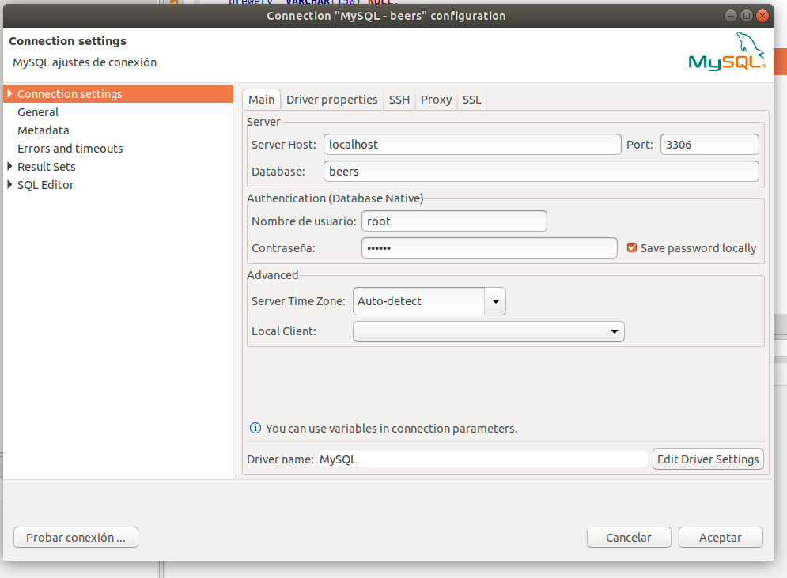

# Api-Beer

### Instalación 🔧

1.  Clonar repositorio

2.  Ejecutar comando o crear .env

```
cp .env_copy

```

3.  Construir imagen y levantar servicios

```
sudo docker-compose up --build

```

4.  Tener en cuenta que las rutas disponibles son las siguientes

```
	"/beers/:beer_id" : para obtener cerveza en especifico
	"/beers"  : para obtener todas las cervezas
    "/beers" : para insertar una cerveza
	"/beerForm" : calcular costo cerveza

```

5.  Con un gestor de bd (por ejemplo DBeaver), conectarse a base de datos, con las credenciales del .env o las de docker-compose (servicio mysql), que son las mismas y ejecutar script:



```
Si no está creada la bd crearla:

CREATE DATABASE beer;

  CREATE TABLE `beers.beer` (
  `id` INT NOT NULL AUTO_INCREMENT,
  `name` VARCHAR(150) NULL,
  `brewery` VARCHAR(150) NULL,
  `country` VARCHAR(150) NULL,
  PRIMARY KEY (`id`));
  
 INSERT INTO beers.beer
(name, brewery, country)
VALUES('test', 'test', 'test');

```


6.  Ejecutar en consola comandos para utilizar endpoints:

```

curl -H "Content-Type: application/json"  127.0.0.1:8080/beers
curl -H "Content-Type: application/json"  127.0.0.1:8080/beers/1
curl -H "Content-Type: application/json" -X POST -d '{"quantity":6,"price":3}' 127.0.0.1:8080/beerForm -v

```

7.  Parar servicios con Ctrl+C

8.  Ejecutar coverage, en la raiz:


```

go test -v ./... -cover 

```

Have a great time!